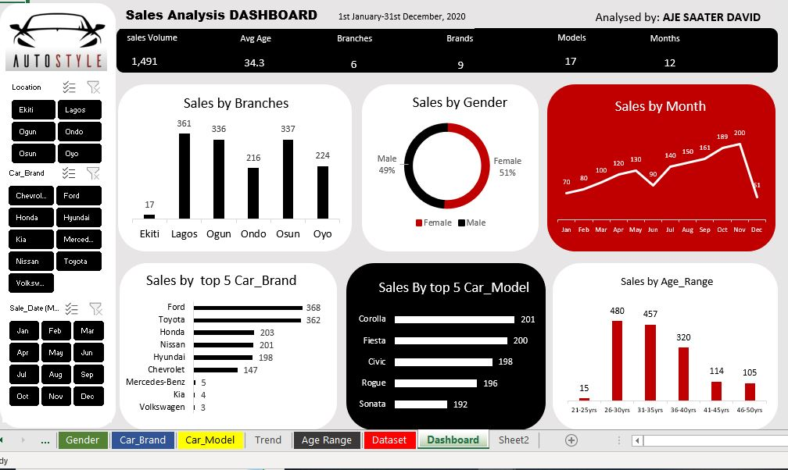

<!--Section 1: Introduce your self-->
## ABOUT ME
I'm Aje S David 🤓, a certified Electrical and Electronics Engineer, a practicing Data Analyst | Cybersecurity analyst in view | Expert in Desktop publishing
<!--Mention your top/relevant skills here - core and soft skills-->
## SKILLS
*Analytics skills:-SQL (advanced), Python, Power BI, Excel✔ Desktop Publishing✔ Graphics.*
**- ✅ Data Cleaning and Transformation.**
**- ✅ Data Wrangling.**. 
<!--Section 2: List 3-4 key projects-->
## MY COMING UP PROJECTS 
*A look of some of the projects I've been working on.*
** My project using AutoStyle Ltd, for sales increase.**

[Read More](https://Auto-Style-Ltd-2020-Sales-Analysispdf.pdf/)

<a href="17 How to Present Data to Executives by Anietie Etuk.pdf">Download the full report here (pdf file)</a>

<a href="17 How to Present Data to Executives by Anietie Etuk.pdf">Download the Report here (pdf file)</a>

## CONTACT DETAILS
*Let’s get in touch!*
<table>
  <tbody>
    <tr>
      <td>📧</td>
      <td><a href="mailto:ajedavid8@gmail.com">ajedavid8@gmail.com</a></td>
    </tr>
    <tr>
      <td>📞</td>
      <td>(234) 706-359-5320</td>
    </tr>
    <tr>
      <td>📍</td>
      <td>DIGC MAKURDI, Nigeria</td>
    </tr>
    <tr>
      <td>⬇️</td>
      <td><a href="MY to use CV.pdf">Download my CV</a></td>
    </tr>
    <tr>
      <td>🌐</td>
      <td><a brief="https://linkedin.com/in/saater-aje-7b2833321">coming up on LinkedIn</a></td>

